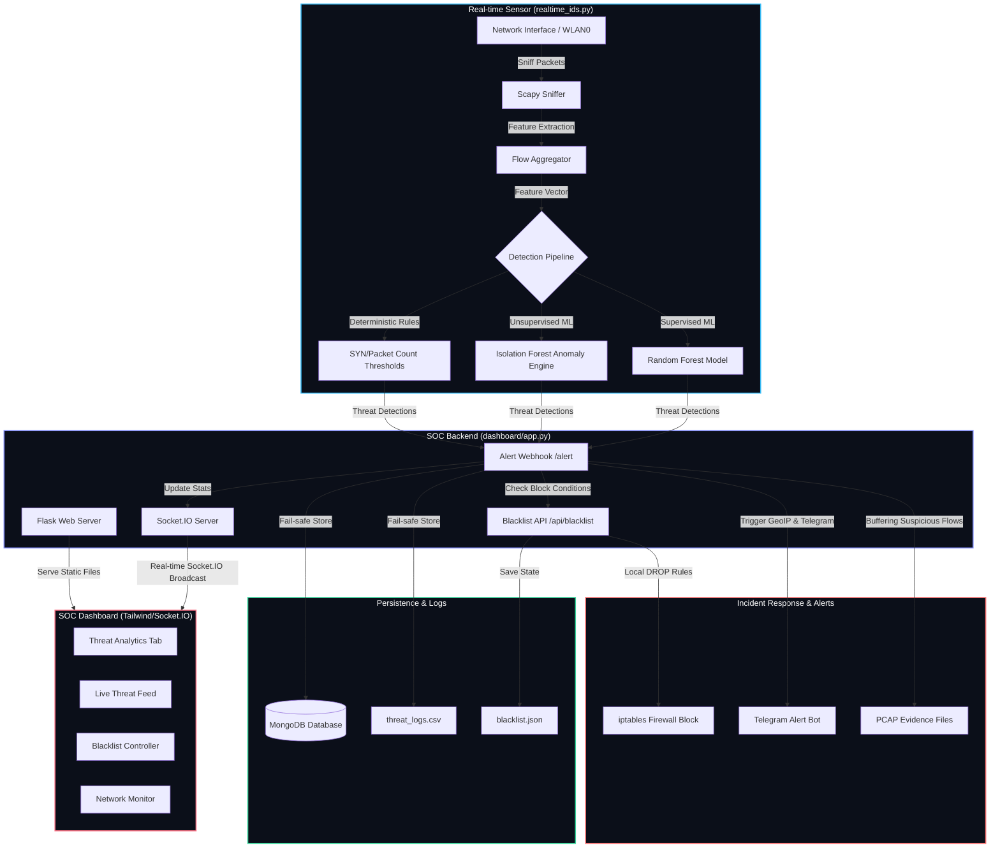

# ThreatVision AI — Real-time AI-Powered IDS & IPS SOC Platform

ThreatVision AI (also known as SentinelX SOC) is an enterprise-grade, full-stack Intrusion Detection and Prevention System (IDS/IPS) designed for real-time network traffic analysis, automated threat prevention, and high-fidelity security visualization. 

The platform leverages a hybrid detection architecture combining **supervised machine learning (Random Forest)**, **unsupervised anomaly detection (Isolation Forest)**, and **deterministic network rules** to detect, block, and analyze network threats instantly.

---

## 🚀 Key Features

*   **Hybrid Multiclass ML Detection:** Identifies 15 distinct threat categories (including DDoS, Botnets, Port Scans, Brute Force, Web Attacks, and SQL Injection) based on features from the benchmark **CICIDS2017** dataset.
*   **Unsupervised Zero-Day Anomaly Detection:** Utilizes an Isolation Forest engine that builds rolling feature buffers in a background thread to score and flag novel anomaly signatures.
*   **Intrusion Prevention & Active Firewall Response (IPS):** Automatically blocks HIGH and CRITICAL severity threat source IPs in real time using local `iptables DROP` policies (supports custom threshold tuning).
*   **Glassmorphic SOC Dashboard:** Responsive dashboard built with Flask, Socket.IO, and Tailwind CSS. Features live packet graphs, alert feeds, and threat mapping.
*   **Digital Forensics (PCAP Evidence):** Automatically captures raw network packet streams corresponding to detected attacks and buffers them into categorized, timestamped `.pcap` files for digital forensics.
*   **Asynchronous Geological Enrichment:** Enriches incoming alerts with Country, City, ISP, and coordinates using async GeoIP queries (leveraging internal locks and caching).
*   **Instant Notification Channel:** Multi-threaded Telegram Bot integration to instantly dispatch high/critical alerts to SOC engineers without impacting the main packet processor.
*   **Fail-Safe Logging Architecture:** Real-time log writer that appends detections directly to a persistent CSV database, with optional MongoDB sync for advanced timeline aggregation.

---

## 📊 System Architecture



---

## 📂 Project Directory Structure

```text
IDS/
├── realtime_ids.py         # Main network sniffer, AI classifier, and live sensor loop
├── live_capture.py         # Simple diagnostic utility to verify Scapy packet sniffer status
├── test_warn.py            # Debug script to test warning filters and feature name alignments
│
├── backend/                # Enterprise modules & microservices
│   ├── database/
│   │   └── mongo_client.py # MongoDB client wrapper with automatic CSV-only fallback
│   ├── ai_models/
│   │   └── anomaly_detector.py # Isolation Forest unsupervised ML engine for Zero-day threats
│   ├── threat_intelligence/
│   │   └── blacklist.py    # IPS control module executing iptables DROP firewall commands
│   ├── ids_engine/
│   │   └── pcap_saver.py   # Foreground Scapy packet saver for forensic analysis
│   ├── api/
│   │   └── analytics.py    # In-memory stats counter and dashboard metrics engine
│   └── utils/
│       ├── geoip.py        # Asynchronous GeoIP geolocation and caching wrapper
│       └── telegram_alerts.py # Telegram notifications service for HIGH/CRITICAL alerts
│
├── dashboard/              # Flask & Socket.IO Web App
│   ├── app.py              # Flask server backend and ingestion API gateway
│   ├── templates/
│   │   └── index.html      # Glassmorphism front-end dashboard interface
│   └── static/
│       ├── style.css       # Custom styles, animations, and glass panel utilities
│       ├── script.js       # Chart.JS bindings, Socket.IO listeners, and UI controller
│       └── logo.png        # ThreatVision AI brand logo
│
├── training/               # AI Model training workflows
│   ├── multi_train.py      # Random Forest classifier trainer utilizing CSV datasets
│   └── model_train.ipynb   # Jupyter Notebook containing model exploration and metrics
│
├── models/
│   └── multi_ids_model.pkl # Pre-trained multiclass ML model serialized with joblib
│
├── logs/
│   ├── threat_logs.csv     # Central CSV file capturing threat history
│   └── blacklist.json      # File containing persistent blocked IP listings
│
├── dataset/                # Place training dataset CSV files here (e.g. CICIDS2017)
└── attacks/                # PCAP files representing filtered forensic evidence are saved here
```

---

## ⚙️ Configuration & Environment Setup

### Prerequisites

*   **Operating System:** Linux (required for firewall `iptables` blocking and raw packet socket sniffing).
*   **Python:** Python 3.8 or higher.
*   **System Dependencies:** You must install `libpcap` on your host system:
    ```bash
    sudo apt-get update && sudo apt-get install -y tcpdump libpcap-dev
    ```
*   **Database (Optional):** MongoDB server running locally on standard port `27017` for timeline storage.

### Environment Variables

Configure the following environment variables to activate all alerting integrations:

```bash
export TELEGRAM_TOKEN="your_bot_token_here"
export TELEGRAM_CHAT_ID="your_channel_or_chat_id_here"
```

*Note: If these variables are not found, ThreatVision AI will run normally and silently bypass Telegram alerts.*

---

## 🛠️ Installation & Setup

1.  **Clone or Navigate to the Workspace Directory:**
    ```bash
    cd /home/ismail/Desktop/IDS
    ```

2.  **Create and Activate a Virtual Environment:**
    ```bash
    python3 -m venv myenv
    source myenv/bin/activate
    ```

3.  **Install Required Dependencies:**
    Create a `requirements.txt` file (or run the installations directly):
    ```bash
    pip install --upgrade pip
    pip install scapy pandas numpy joblib requests pymongo flask flask-socketio flask-cors scikit-learn
    ```

4.  **Verify Scapy Capture Diagnostics:**
    Run the simple packet logger to make sure your network device interface is accessible:
    ```bash
    sudo myenv/bin/python live_capture.py
    ```

---

## 🚀 Running the Platform

To run the full stack, you should open three terminal windows/panes with the virtual environment activated:

### Step 1: Start MongoDB (If used)
Ensure MongoDB is running locally:
```bash
sudo systemctl start mongod
```
*If MongoDB is not installed, the platform automatically drops back to `logs/threat_logs.csv` fallback mode.*

### Step 2: Start the SOC Dashboard & Web Backend
Run the dashboard web backend. It serves the Flask UI and manages websocket notifications:
```bash
python dashboard/app.py
```
Open [http://127.0.0.1:5000](http://127.0.0.1:5000) in your web browser to view the SOC dashboard.

### Step 3: Run the Real-Time IDS Engine
The packet sniffer requires superuser rights to bind to raw sockets. Ensure you specify the correct network interface in `realtime_ids.py` (e.g. `wlan0` or `eth0` in line 314):
```bash
sudo myenv/bin/python realtime_ids.py
```

---

## 🔬 Model Training

If you wish to re-train the supervised Random Forest model on your custom datasets:

1.  Place the cleaned CSV dataset files into the `dataset/` directory.
2.  Run the training script:
    ```bash
    python training/multi_train.py
    ```
3.  The pipeline compiles the combined datasets, cleans infinite values, encodes attack labels, trains the model, and outputs a classification report before replacing `models/multi_ids_model.pkl`.

---

## 🛡️ Attack Labels Mapping

The supervised classifier identifies the following classes:

| Class ID | Attack Label | Severity |
|---|---|---|
| **0** | `BENIGN` | LOW |
| **1** | `Bot` | HIGH |
| **2** | `DDoS` | CRITICAL |
| **3** | `DoS GoldenEye` | CRITICAL |
| **4** | `DoS Hulk` | CRITICAL |
| **5** | `DoS Slowhttptest` | CRITICAL |
| **6** | `DoS slowloris` | CRITICAL |
| **7** | `FTP-Patator` | HIGH |
| **8** | `Heartbleed` | MEDIUM |
| **9** | `Infiltration` | MEDIUM |
| **10** | `PortScan` | HIGH |
| **11** | `SSH-Patator` | HIGH |
| **12** | `Web Attack Brute Force` | MEDIUM |
| **13** | `Web Attack Sql Injection` | MEDIUM |
| **14** | `Web Attack XSS` | MEDIUM |

---

## 📜 License & Attributions

*   **CICIDS2017 Dataset:** Provided by the Canadian Institute for Cybersecurity.
*   **Packet Capture:** Built on top of the Scapy packet manipulation library.
*   **License:** MIT License. Designed for academic research, security demonstration, and defensive simulation.
